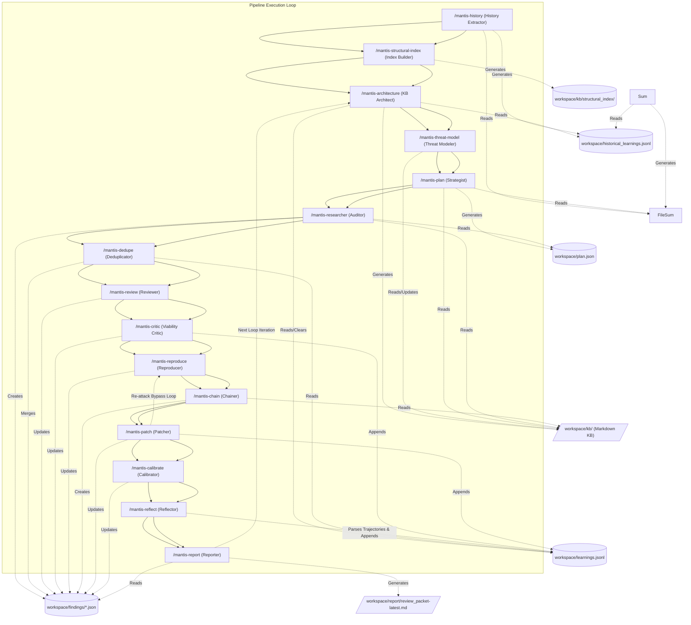

# Mantis Skills: Reference Guide for AI Agents

> [!CAUTION] **USE AT YOUR OWN RISK. BE EXTREMELY CAREFUL.** This suite is
> designed to generate and execute autonomously generated code that may be
> unstable or perform unexpected actions. **USE THIS ONLY IN ISOLATED,
> RESTRICTED ENVIRONMENTS.** Never run this suite on a machine with access to
> production systems, sensitive data, or internal networks. See the "Advanced /
> Unattended Cloud Deployment (GCE)" section for mandatory hardening
> requirements.

> [!IMPORTANT] **RESPONSIBLE USE** AI models are non-deterministic and can
> hallucinate findings or generate incorrect patches. **All findings must be
> manually verified by a security expert before being reported.** Do not
> mass-file unverified, AI-generated reports to open-source maintainers. A
> failure to automatically reproduce a vulnerability does not definitively mean
> it is a false positive, nor does a successful reproducer guarantee the bug is
> exploitable in all contexts. Use these skills responsibly.

This document is the canonical reference guide for AI Agents operating in this
workspace. It describes the Mantis pipeline architecture, the individual skills
(stages), the inter-stage data contracts, and the design patterns required to
run and extend the pipeline.

For more information on securing AI systems, see Google's
[Secure AI Framework (SAIF)](https://safety.google/safety/saif/).

As an agent, you must adhere to the contracts, file paths, and execution
patterns defined in this document.

______________________________________________________________________

## Prerequisites and Setup

Before executing any skills, ensure your local CLI environment is fully
configured. Mantis is platform agnostic and works with Gemini CLI, Antigravity
CLI, Google ADK, and other coding agent frameworks. Consider:

1. **Docker**: For running testing containers.

2. **gVisor (runsc)**: For enhanced security when executing untrusted
   AI-generated crash reproducer code, register the `runsc` runtime with
   networkless execution
   (`sudo runsc install -- --network=none && sudo systemctl restart docker`) or
   configure `/etc/docker/daemon.json`:

   ```json
   {
     "runtimes": {
       "runsc": {
         "path": "runsc",
         "runtimeArgs": [
           "--network=none"
         ]
       }
     }
   }
   ```

3. **Ollama / OpenAI-compatible endpoint**: For running local or hosted LLMs.
   The default model is **DeepSeek** (`ollama/deepseek-v4-flash:cloud`). Start a
   local Ollama daemon (`ollama serve`, then `ollama pull deepseek-v4-flash`) for a
   local/offline build, or point `LLM_API_BASE` at any OpenAI-compatible server
   (e.g. Ollama Cloud, `https://ollama.com/v1`). No cloud SDK or account credentials
   are required for the default local-Ollama path. **If using hosted/`:cloud`
   models**, provide an API key in a git-ignored `.env` file (template:
   `reference/.env.example`),
   e.g. `OLLAMA_API_KEY=your-key` for Ollama Cloud.

To install the skills via CLI:

```shell
npx skills add google/mantis
```

______________________________________________________________________

## Adaptability & Specialized Domains

While the default skills look for generic security issues, business logic
problems, and authorization vulnerabilities in typical web/cloud applications,
they can be adapted for:

- **Hardware / RTL Reviews**: Auditing Register-Transfer Level (RTL) designs
  (SystemVerilog, VHDL) for security properties or logical bugs.
- **Infrastructure-as-Code (IaC)**: Analyzing cloud deployment boundaries,
  Terraform state, or Kubernetes RBAC configurations for privilege escalation
  paths.
- **Data & ML Pipelines**: Auditing training data ingress, model serialization
  formats (e.g., Pickle vulnerabilities), or boundary constraints between data
  science notebooks and production.
- **Compiled Binaries & Firmware (Gray-Box Auditing)**: Pointing the suite at
  compiled release artifacts (using tools like `unblob`, `Ghidra`, `radare2`,
  `qemu`, or `unicorn`) without providing source code. The intent of this mode
  is to emulate a third-party security researcher, allowing you to see exactly
  what vulnerabilities are discoverable by adversaries who only have access to
  your released binaries.
- **Custom Test Environments**: Replacing the default container reproduction
  stage with isolated VMs, physical hardware testbeds (via USB/serial), or
  custom simulators.

______________________________________________________________________

## Architecture and Sequential Flow

The Mantis Skills suite is designed as a modular, decoupled set of tools that
can be executed sequentially or in parallel. Each stage reads and writes to a
shared state stored on disk.

> [!IMPORTANT] **Snapshot Model (opt-in living/synced support):** By default the
> pipeline reviews a **single, static snapshot** of the target and does not sync
> or watch a live codebase — this is the unchanged, default behavior. When the
> **opt-in** snapshot model is enabled (`--sync` / snapshot arguments), each
> pass pins its own **immutable** copy of the target, every stage reads that
> pinned copy (so edits made mid-pass are ignored), every finding is stamped
> with the snapshot it was discovered against, and the target is synced only
> **non-destructively, at a pass boundary**. Run WITHOUT these arguments and
> each stage runs with default behavior (a point-in-time review of the current
> directory with all verdicts permitted) — rather than stopping. Reserve
> "non-authoritative" for HALT mode (`--sync` requested but snapshot could not
> be pinned). See [The Snapshot Model](#the-snapshot-model) for the full
> contract.



01. **`/mantis-history` (History Extractor):** An optional pre-processing step
    that analyzes the repository's version control system (VCS) history to
    extract past vulnerabilities, security fixes, and vulnerability patterns,
    saving findings to `workspace/historical_learnings.jsonl`.

02. **`/mantis-structural-index` (Structural Index Builder):** An optional stage
    that builds a content-addressed semantic-unit index from source code,
    writing `workspace/kb/structural_index/manifest.json` + `catalog.sqlite`
    (with `structural_index.jsonl` as a compatibility pointer). It runs
    immediately after the snapshot is pinned and before the first code-reading
    analysis stage. Uses capability-based per-partition backend selection
    (prebuilt SCIP/Kythe, compiler, AST, ctags, regex, grep — degrading
    gracefully). Supports content-addressed unit reuse and incremental overlays.
    When unpinned it builds against the current directory. The index is
    HINT-only — it never gates findings and degrades to grep when unavailable.
    Consumers query via `workspace/helpers/query_structural_index.py` for
    bounded, paginated results.

03. **`/mantis-architecture` (Knowledge Base Architect):** Analyzes the codebase
    and clears the `workspace/learnings.jsonl` inbox to synthesize a permanent,
    interlinked Markdown Knowledge Base (`workspace/kb/`) detailing entities,
    data flows, and historical vulnerability classes.

04. **`/mantis-threat-model` (Threat Modeler):** Evaluates the entities and
    architecture defined in the KB to establish or refine a living
    `workspace/kb/THREAT_MODEL.md`, focusing on trust boundaries and attacker
    profiles.

05. **`/mantis-plan` (Strategist):** Scans workspace boundaries and reads the KB
    indices to output a targeted review strategy into `workspace/plan.json`,
    injecting specific `kb_references` file paths for context.

06. **`/mantis-researcher` (Mantis Researcher):** Executes file-by-file triage
    and deep security flaw reviews, outputting hotspots as individual JSON files
    in `workspace/findings/`.

07. **`/mantis-dedupe` (Deduplicator):** Groups index-based duplicate findings,
    merging records and deleting redundancies within `workspace/findings/`.

08. **`/mantis-review` (Validator):** Filters out false positives using strict
    pragmatic constraints, updating the status in
    `workspace/findings/<id>.json`.

09. **`/mantis-critic` (Critic):** Verifies release-build crash reproducibility
    (ignoring debug/assert checks), updates production viability in
    `workspace/findings/<id>.json`, and appends false positives/non-viable paths
    to `workspace/learnings.jsonl`.

10. **`/mantis-reproduce` (Proof-of-Concept Developer):** Writes
    Proof-of-Concept Reproduction Scripts (Repros) or raw payloads, executes
    them using a Tiered Iterative Reproduction strategy (unit micro-harness ->
    functional subsystem -> full sandboxed service) with
    intra/inter-conversation retries in isolated environments (gVisor, VMs,
    QEMU), and updates reproduction status in `workspace/findings/<id>.json`.

11. **`/mantis-chain` (Vulnerability Chainer):** Analyzes individual validated
    findings and knowledge base primitives to identify and construct complex
    multi-step exploit chains, creating new "Super Findings" in
    `workspace/findings/`.

12. **`/mantis-patch` (Patcher):** Acts as an impartial remediation conductor
    with strict separation of duties. Delegates code synthesis to isolated
    patch-author subagents, commissions objective third-party re-attackers using
    parallel trajectory search for adversarial attack generation, verifies fixes
    in isolated sandboxes, updates patch status in
    `workspace/findings/<id>.json`, and appends logs to
    `workspace/learnings.jsonl`.

13. **`/mantis-calibrate` (Risk Calibrator):** Calculates a final numerical
    Mantis Risk Score (1-10) for each finding in the workspace directory based
    on impact, evidence, and viability, appending the results directly to each
    `workspace/findings/<id>.json` file.

14. **`/mantis-reflect` (Reflector):** Parses the execution trajectories of the
    agents from the current round, extracting false assumptions, tool failures,
    and successes, and appends these structured insights to the
    `workspace/learnings.jsonl` inbox.

15. **`/mantis-report` (Reporter):** Generates a human-readable security review
    packet containing verified/reproduced findings, evidence, risk rationales,
    and patch information at `workspace/report/review_packet-latest.md`.

### Auxiliary & Operational Skills

- **`/mantis-configure` (Configuration & Preflight Wizard):**
  ([`reference/skills/mantis-configure/SKILL.md`](reference/skills/mantis-configure/SKILL.md))
  Manages sandbox selection (`static-only`, `microsandbox`, `gvisor`, `gce`),
  LLM provider options, and fast preflight testing.
- **`/mantis-launch` (Automated Launch & Healing Supervisor):**
  ([`reference/skills/mantis-launch/SKILL.md`](reference/skills/mantis-launch/SKILL.md))
  Validates the environment, performs preflight checks, and executes the
  pipeline with automatic sandbox downgrade fallback.
- **`/mantis-advise` (Developer Security Advisor):**
  ([`mantis-advise/SKILL.md`](mantis-advise/SKILL.md)) Queries threat models,
  historical vulnerability lineages, verified patch diffs, triaged false
  positives, and learned trajectory invariants from `knowledge.db` before and
  during code edits.

### Running the Pipeline (Manual Mode)

You can execute the reviewing stages sequentially from inside your active CLI
terminal:

```text
# 0. (Optional) Configure environment models and sandboxes
/mantis-configure

# 0a. (Optional) Analyze repository's version control system (VCS) history
/mantis-history

# 0b. (Optional) Build content-addressed semantic-unit index
/mantis-structural-index

# 1. Synthesize codebase structure and historical learnings into Markdown KB
/mantis-architecture

# 2. Iteratively develop living threat model based on the KB
/mantis-threat-model

# 3. Map target external boundary and build scanning roadmap
/mantis-plan

# 4. Run multi-threaded/sequential security flaw sweep
/mantis-researcher

# 5. Consolidate overlapping files and duplicate bugs
/mantis-dedupe

# 6. Verify code validity & filter false positives
/mantis-review

# 7. Eliminate non-viable production issues
/mantis-critic

# 8. Generate proof-of-concept crash reproducers and run in sandboxes
/mantis-reproduce

# 9. Combine validated findings into multi-step exploit chains
/mantis-chain

# 10. Apply minimal fixes and verify they block the crash reproducer
/mantis-patch

# 11. Calculate final matrix risk ratings and append to findings
/mantis-calibrate

# 12. Extract insights from execution trajectories to learnings inbox
/mantis-reflect

# 13. Generate human-readable security review packet report
/mantis-report
```

______________________________________________________________________

## The Snapshot Model

Mantis can review **living / synced codebases** through a **snapshot-per-pass**
model. It is **opt-in and default off**: with no `--sync` flag and no snapshot
arguments, a run behaves byte-for-byte as before — a single, point-in-time
review of whatever is on disk (see *Unpinned / HALT Execution*, below). Enabling
it makes long-running, continuous reviews of a changing codebase correct instead
of silently wrong.

**Opt-in, default off.** Passing `--sync` (or instructing the orchestrator to
sync) enables the model. Without it, `snapshot_pinned` is never set and every
snapshot-aware check falls through to its pre-existing behavior.

**Each pass pins one immutable snapshot.** At the very start of a pass the
orchestrator materializes an isolated, read-only copy of the target — a
`git worktree` / `hg archive` when the tree is clean, a full copy otherwise —
under `.mantis_snapshots/` (never under `workspace/`). It writes a sentinel file
`.mantis_snapshot_id` into that copy and records the snapshot in state. Every
stage then reads target code through this pinned root (`--snapshot_root`),
identified by a `SNAPSHOT_ID` (`--snapshot_id`).

**How `SNAPSHOT_ID` is computed (the ladder).** The id is computed once per
pass:

- clean git / hg → `commit_hash`
- dirty git / hg → `commit_hash:content_hash`
- multi-vcs (`.repo`) → `revision:content_hash` (a bare manifest revision is a
  branch name and is never trusted for equality on its own)
- no VCS / unknown, copyable → `content:<content_hash>`
- single binary / firmware → `sha256:<artifact_hash>`
- live endpoint / uncopyable / copy failed → `live:<ISO8601>`, and the pass runs
  **unpinned**

`content_hash` is a SHA-256 over **every** file in the pinned copy. Because the
dirty / no-VCS / multi-vcs tiers embed that content hash, an **unchanged dirty
or no-VCS tree still matches across passes** and receives full verification and
deduplication, while a tree that actually changed does not.

**Findings are pinned to their discovery snapshot.** Each finding records a
`discovery_commit` — the `SNAPSHOT_ID` it was found against. Trusting decisions
(dedupe filtering, false-positive / non-viable verdicts, reproduction, patching,
chaining) proceed only when a finding's `discovery_commit` **exactly equals**
the current `SNAPSHOT_ID`. A finding discovered against a different or absent
snapshot is re-researched / re-verified — never silently filtered, dropped, or
marked secure.

**Edits made mid-pass are ignored.** Because every stage reads the pinned copy,
changes to the live tree *during* a pass cannot shift line numbers, break
reproducers, or corrupt patches within that pass. Builds and generated artifacts
are written to a private temporary shadow, never under the pinned root. New code
is picked up at the **next** pass boundary.

**Boundary sync is non-destructive and only at a pass boundary.** When enabled,
sync is the first action of a pass and runs only when `workspace/findings/` is
empty (the previous pass's findings have been archived), so no in-flight finding
is stranded across a code change. Sync is strictly non-destructive: it is
skipped entirely if the tree is dirty, ahead of upstream, on a detached HEAD, or
has no upstream, and it never runs `git reset --hard`, `git checkout -- .`,
`git clean`, `hg update -C`, or anything else that discards local work. When it
does run it is fast-forward only (`git fetch && git merge --ff-only`,
`hg pull && hg update --check`, `repo sync -c`); any failure keeps the current
tree and proceeds. After a successful sync the code has changed, so the
Knowledge Base and directory summaries from the previous snapshot are stale and
must be **force-refreshed** (re-run `/mantis-architecture`) before planning the
new pass.

**Unpinned / HALT Execution (never deadlocks).** The snapshot model branches on
`active_snapshot` presence:

- **Unpinned / Single-Pass** (`active_snapshot` ABSENT — plain interactive /
  manual use, or an orchestrator that does not implement multi-pass lifecycle):
  the stage does **not** stop. It runs as a point-in-time review of the current
  directory with **all verdicts permitted** (`VERIFIED_SECURE`,
  `failed_to_reproduce`, `DUPLICATE`, etc. are all emittable). Every snapshot
  match check reports "not matched" (no `active_snapshot` to compare against).
  Mid-run edits are not frozen.

- **HALT** (`active_snapshot` PRESENT with `snapshot_pinned = false` — `--sync`
  was requested but the snapshot could not be pinned: live endpoint,
  too-big-to-copy, copy failure, dirty/racing tree): the stage does **not**
  stop, but runs **degraded**: results are non-authoritative, and no
  authoritative `VERIFIED_SECURE` / `failed_to_reproduce` verdict is emitted
  (the HALT ceiling forces `not_attempted` / `VERIFICATION_INCOMPLETE` instead).
  Live-endpoint or uncopyable targets run in HALT by design when `--sync` is
  requested.

**Absent → conservative (backward compatible).** Every new field is optional.
Any absent / empty / null new field routes to the safe branch: absent
`discovery_commit` → re-research; absent `snapshot_history` predecessor → treat
all files as changed; absent reached-sink evidence → `not_attempted` (never a
negative verdict); absent `active_snapshot` → unpinned single-pass execution
(all verdicts permitted). No new `required` field or `allOf` gate is added, so
existing workspaces and pre-upgrade findings validate and run unchanged.

**New optional state/finding fields and stage flags.**

- **State**: `active_snapshot`
  `{root, snapshot_id, snapshot_pinned, pass, vcs_type}`; append-only
  `snapshot_history` (one `{pass, snapshot_id, snapshot_pinned, timestamp}`
  entry per pass, never overwritten); `vcs_info` continues to record `vcs_type`
  / `commit_hash` / `revision` / `dirty`.
- **Finding**: `discovery_commit` — the `SNAPSHOT_ID` the finding was discovered
  against.
- **Flags every stage accepts**: `--snapshot_root=<pinned copy>`,
  `--snapshot_id=<SNAPSHOT_ID>`, `--state_root=<workspace parent>`, and
  (orchestrator only) `--sync` to enable boundary sync. `--target_root`
  overrides all of these when a caller hands a stage a prepared tree (for
  example, a patched shadow during re-attack verification).

Any conformant harness (CLI, ADK, or a custom deterministic pipeline) implements
this per pass: sync first, detect VCS and compute `SNAPSHOT_ID`, pin the
immutable copy and write the sentinel, record `active_snapshot` / append
`snapshot_history`, run every stage with `--snapshot_root` / `--snapshot_id` /
`--state_root`, then archive findings and increment the pass. A harness that
does not implement it leaves `snapshot_pinned` unset and gets today's behavior.

______________________________________________________________________

## Building Deterministic Pipelines (Production-Grade)

While an autonomous agent session provides dynamic steering for exploratory
security research, we highly recommend wrapping the Mantis Skills in a
**deterministic programmatic pipeline** for use in enterprise or production
settings.

While Python, Bash, or CI/CD workflows are common choices for writing these
deterministic pipelines or custom helper scripts, **Rust** is another option
that some teams have found effective. Rust can be well-suited for
agent-generated code due to:

- **Type and Memory Safety:** Rust's strong static typing and borrow checker
  catch memory safety issues and certain type-level bugs at compile time. While
  this does not prevent logic errors, it can reduce common runtime crashes.
- **Compiler Feedback:** The Rust compiler provides detailed error messages and
  structured suggestions. Some LLMs can utilize this feedback to iteratively
  resolve syntax and type errors during generation.
- **Performance:** Rust provides native performance and predictability, which
  can be beneficial for high-throughput coordination.

The choice of language should depend on your team's familiarity and the target
environment. Some anecdotal reports suggest Rust can work well for complex
orchestrations, but success rates vary significantly based on the specific task,
prompt design, and the model class used.

By treating the individual skills (like `/mantis-researcher`, `/mantis-review`,
and `/mantis-reproduce`) as microservices that read and write JSON state in the
`workspace/findings/` directory, you can build a rigid orchestrator that
provides stronger reliability and security guarantees. Better yet, you should
use more durable and resilient databases instead of json files on a single
machine.

**Before building your harness, strictly adhere to the inter-stage data
contracts defined in [schema.json](schema.json).**

### Structural Code Index (AST-Level Context)

For large codebases where grep-based call-site discovery is unreliable, the
**Structural Code Index** is an optional first-class stage
(`/mantis-structural-index`) that builds a content-addressed semantic-unit index
from source code using capability-based per-partition backend selection
(prebuilt SCIP/Kythe, compiler, AST, ctags, regex — degrading to grep). It
supports content-addressed unit reuse, incremental overlays, and a bounded query
interface. It runs immediately after the snapshot is pinned and before the first
code-reading analysis stage. See
[mantis-structural-index/SKILL.md](mantis-structural-index/SKILL.md) for the
full specification.

> **Note on Standalone vs. Harness Mode:** When using Mantis Skills directly
> from the CLI in standalone mode, skills like `/mantis-review` or
> `/mantis-patch` will instruct the LLM to write temporary reusable Python
> scripts to update the JSON state files. However, in a true programmatic
> harness, your orchestrator should override these instructions and provide
> native tool calls or functions for state management to avoid forcing the LLM
> to write one-off scripts.

### The ADK Reference Implementation (`reference/`)

This repository includes a production-grade reference harness located in
[`reference/`](reference/), built directly on top of the **Google Agent
Development Kit (ADK)**. It serves as an authoritative implementation of the
Mantis architecture:

1. **Declarative Workflow Graph (`workflow.json` / `core/graph_loader.py`)**:

   - Compiles 15 sequential agent nodes into native ADK `Workflow`, `Agent`, and
     `Classifier` constructs.
   - Injects high-density, minimal system prompts directly via
     `reference/core/prompts.py` (`STAGE_PROMPTS`), bypassing Turn-1
     `load_skill` overhead and preserving model token budgets.
   - Attaches specialized domain tools directly to agents with stage isolation
     (`include_contents="none"`), preventing cross-turn context pollution.

2. **Layered Configuration Overlay (`workflow.local.json`)**:

   - **`workflow.json` (Tracked)**: Contains template configurations and clean
     placeholder values (`YOUR_PROJECT_ID`).
   - **`workflow.local.json` (Gitignored)**: Automatically generated overlay for
     local developer machines, containing resolved GCP projects, active
     sandboxes, and model overrides.
   - Auto-configuration (`scripts/configure.py --auto`) and launch tools
     (`scripts/launch.py` / `./run.sh`) write strictly to `workflow.local.json`
     to keep developer git trees clean.

3. **Pluggable Sandboxed Environments (`core/sandboxes/`)**:

   - **`StaticOnlyEnvironment` (`"static-only"`)**: Safe static analysis only;
     dynamic crash reproduction and patch verification are skipped.
   - **`GvisorEnvironment` (`"gvisor"`)**: OCI container isolation via
     Docker/Podman and gVisor `runsc` with `--network=none`.
   - **`MicrosandboxEnvironment` (`"microsandbox"`)**: In-process hardware
     microVM isolation via `libkrun` and `Network.none()`.
   - **`GceEnvironment` (`"gce"`)**: Hardened ephemeral Google Compute Engine VM
     isolation in a private non-internet VPC with DNS blackholing, IAP
     tunneling, and IAM token suppression.

4. **Deterministic Lineage Anchors & Agentic Deduplication (`core/database.py` /
   `mantis-dedupe`)**:

   - **Tier 1 (Exact Content Signature)**: Sub-millisecond deterministic
     `sha256(canonical_fp | canonical_cwe | target_symbol)` hash matching.
   - **Tier 2 (Structural Tuple Match)**: Canonical filepath + normalized CWE +
     target symbol anchor matching.
   - **Tier 3 (Line Proximity Window)**: Filepath and normalized CWE match
     within a strict $\\le 3$ line drift window when target symbol is empty.
   - **Hierarchical Clustering**: Partitions findings by subsystem and filepath
     into manageable candidate clusters, avoiding cross-module mixing.
   - **Agentic Deduplication (`mantis-dedupe`)**: Reasoning agent analyzes
     structural equivalence, dataflow convergence, and root cause equivalence to
     merge findings into primary records while preserving lineage history.
   - **Fail-Closed Fallback**: Any finding that does not decisively match
     preserves or mints a distinct UUIDv4, eliminating false merges without
     cloud egress or external embedding model dependencies.

5. **Operational CLI Tools & Developer Skills**:

   - **`scripts/configure.py` (`mantis-configure`)**: Interactive wizard,
     auto-detection, and ~1s preflight validation (see
     [`reference/skills/mantis-configure/SKILL.md`](reference/skills/mantis-configure/SKILL.md)).
   - **`scripts/launch.py` (`./run.sh` / `mantis-launch`)**: Autonomous runner
     with preflight sanity checks and graceful sandbox downgrade handling (see
     [`reference/skills/mantis-launch/SKILL.md`](reference/skills/mantis-launch/SKILL.md)).
   - **`scripts/advise.py` (`mantis-advise`)**: Developer security advisor
     querying threat models, historical lineages, and verified patch diffs.

6. **Open Knowledge Format (OKF v0.2) Semantics (`core/database.py` /
   `scripts/advise.py`)**:

   - **`okf_concepts` Storage**: SQLite schema version 3 stores scoped concepts,
     YAML frontmatter, and canonical trust tiers (`unverified`, `heuristic`,
     `machine_confirmed`, `human_reviewed`) per OKF spec §5.3.
   - **Bundle Import/Export**: Bi-directional OKF bundle exchange
     (`export_okf_bundle` / `import_okf_bundle`) with CLI support
     (`scripts/advise.py --export-okf <dir>` and `--import-okf <dir>`).
   - **Contextual Advisory Dossiers**: Generates scoped security guidance with
     trust badges, threat boundaries, guardrail invariants, and few-shot
     verified patch diffs.

7. **Tamper-Proof Hermetic Dependencies (`requirements.txt` / `install.sh`)**:

   - Pinned and fully hashed dependency manifests compiled via `pip-tools`
     (`reference/requirements.in` and `reference/sandbox/requirements.in`).
   - `install.sh` enforces `--require-hashes` during installation to guarantee
     hash verification and supply-chain integrity.

### Why Build a Programmatic Harness?

- **Determinism:** Some stages such as the reproduction agent or patch agent
  include recommendations to have subagents criticize the repro or patch. While
  it is reasonable to demonstrate the overall workflow, a more deterministic
  critic stage that the agent cannot bypass by "forgetting" to call the critic
  subagent will likely produce better results.
- **Mitigates Prompt Injection Risk:** An LLM orchestrating shell commands is
  susceptible to host-level prompt injection if it ingests malicious code.
  Moving the orchestration to a hardened deterministic pipeline removes the
  LLM's control over the host environment.
- **Enforces Strict Sandboxing:** Rather than relying on the LLM to remember to
  use `--network none` when executing a crash reproducer, your deterministic
  harness can programmatically enforce that untrusted AI-generated payloads are
  executed exclusively within a locked-down VM, container, or gVisor sandbox.
- **CI/CD Integration:** A deterministic script executing the static analysis
  and deduplication stages is predictable and easily integrated into standard
  automated workflows like GitHub Actions or Jenkins.
- **Scale:** The pipeline can be decomposed into several pieces, allowing you to
  scale horizontally across a suitably sized fleet during periods of low
  utilization.
- **Deterministic Reporting:** While the pipeline relies on machine-readable
  JSON files (`workspace/findings/*.json`) to safely maintain internal state, a
  programmatic harness can deterministically translate these JSON findings into
  human-readable Markdown reports or automatically file them into bug-tracking
  systems without risking LLM hallucination or state corruption. Only use an LLM
  for deterministic subsets of this reporting process, such as providing an
  executive summary if necessary.

### The Hybrid Approach

To maintain the dynamic, adaptive nature of the suite while ensuring
deterministic execution, you can build a pipeline that:

1. **Iterates Programmatically:** A harness loops over the workspace, invoking
   the static and dynamic skills via the CLI.
2. **Feeds Learnings Back:** The harness takes the resulting
   `workspace/learnings.jsonl` file and invokes `/mantis-plan` to generate a
   newly updated `workspace/plan.json`, effectively allowing the AI to guide the
   deterministic runner on what to analyze next.
3. **Hardcodes the Execution Sandbox:** You can optionally configure the
   deterministic versions of `/mantis-reproduce` and `/mantis-patch` to *only
   generate* the patch or script file, leaving the actual execution and grading
   to your harness in a strictly controlled sandbox.

______________________________________________________________________

## Exploit Chains and Reproduction Limits

The Mantis pipeline supports identifying complex, multi-step exploit chains (via
`/mantis-chain`), but **it does not attempt to programmatically write or execute
end-to-end reproduction scripts for these chains**.

- **Constituent Reproduction Only:** The pipeline only reproduces the
  individual, constituent findings.
- **Static Confirmation:** An exploit chain finding is marked as
  `statically_confirmed` if all its constituent findings have been individually
  confirmed (either reproduced or statically confirmed).
- **Simplification Decision:** This is an intentional design decision to limit
  complexity, as automated multi-stage exploit orchestration is highly
  environment-dependent. Users wishing to verify end-to-end chains must write
  custom orchestrators or manually verify the combined flow.

______________________________________________________________________

## Patch Verification and Re-attack Constraints

The `schema.json` contract defines validation rules for findings that have been
patched. While `/mantis-patch` is designed to verify patches using a re-attack
step (confirming `reattack_status`), the schema supports several distinct
verification outcome statuses:

- **`VERIFIED_SECURE`**: Completed verification, meaning the post-patch run
  passed AND a successful variant-hunting re-attack was executed. The
  independent re-attack agent authors N ≥ 3 boundary-mutated variant inputs
  (off-by-one around the fixed bound, len±1, sign flips, alternate paths to the
  same sink for memory-safety bugs; equivalent payloads and alternate endpoints
  for non-memory-safety bugs) and the patched shadow must survive ALL of them
  before `VERIFIED_SECURE` is set. An empty or short variant set caps at
  `VERIFICATION_INCOMPLETE` — a vacuous "all zero variants failed" never
  qualifies. A variant only counts as a bypass if it reproduces the original
  vulnerability class (same sink/crash type); junk mutants are discarded.
- **`MITIGATION_PROPOSED`**: Set for binary targets where code patching is not
  possible but a functional or architectural mitigation is proposed in
  `patch_diff`. These may bypass code modification and re-attack checks.
- **`VERIFICATION_INCOMPLETE`**: Set when the initial post-patch verification
  run passed but the subsequent re-attack checks were interrupted or failed due
  to environment timeouts, infrastructure errors, or sandbox limits.

Re-attack fields (`reattack_status`, etc.) are strictly required only when
`patch_status` is `VERIFIED_SECURE`. This is an intentional design decision to
support binary-only targets and verification fallbacks.

______________________________________________________________________

## The Reality of Non-Determinism

A critical concept to understand when using AI for security research is
**Non-Determinism**.

- **Coverage is not an absolute guarantee:** Even though Stage 2
  (`/mantis-plan`) attempts to use programmatic shell scripts to map your entire
  codebase, the agent running those scripts is fundamentally non-deterministic.
  It might occasionally fail to run the script correctly, hallucinate
  parameters, or skip steps.
- **Trajectory/Conversation analysis:** One way to mitigate the lack of
  determinism is to programmatically review all the tool calls made by the
  agents to see what they've done. This can be used to calculate coverage and
  efficiency metrics, although what those numbers mean exactly we will leave to
  your imagination.
- **Reasoning shifts across loops:** Because the LLM's analysis is
  non-deterministic, it may miss a subtle business logic flaw or authorization
  bypass on Pass 1 but identify it clearly on Pass 5 as its internal "attention"
  shifts or as it gains context from other findings. This is why we generally
  recommend running this scanning pipeline many times.
- **Diminishing Returns:** You might expect the pipeline to eventually "finish"
  and stop reporting bugs. In reality, the discovery of findings often does not
  stop completely; rather, the *quality and severity* of the findings will
  eventually degrade as the LLM starts hallucinating or reaching for pedantic
  non-issues.

The continuous loop is designed to leverage this non-determinism allowing the AI
multiple passes to catch things it missed. However, **it is up to each user to
experiment with the suite, review the Risk Calibrator scores on the findings,
and determine for themselves when the quality of findings has dropped enough to
pause the loop.** In the long term you will also have to determine how often to
rescan, such as when new models with greater capabilities are made available or
when a codebase has received sufficiently large changes to warrant a complete
rescan instead of just an analysis of a given diff or changelist.

______________________________________________________________________

## Autonomous Orchestration Pattern

For a truly autonomous and persistent security operation, you can employ the
**Autonomous Orchestration** pattern (via the ADK runner
`python3 reference/main.py` or an overarching supervisor session). In this
setup, the orchestrator is responsible for driving the entire reviewing
pipeline.

### The Orchestrator's Role:

- **Orchestration:** The Orchestrator manages the execution of each stage
  natively using workflow nodes or CLI subagent delegation.
- **Persistence:** It operates across passes and restarts using state
  checkpoints, ensuring that the review continues working towards the goal of
  security flaw discovery, patching, and reporting.
- **Supervision:** It monitors task health, handles environmental degradation
  gracefully, logs invariants, and ensures the pipeline remains operational.
- **Interactive Steering:** You can query pipeline status, inspect
  `knowledge.db`, or provide high-level strategic guidance (e.g., "Deep dive on
  the image parser") to influence focus in real-time or in the next loop.
- **Security Boundaries:** Strictly confine execution within the hardened
  security boundaries previously described (VPC-SC, no external internet, and
  restricted IAM roles).

This pattern transforms the suite from a set of disjointed tools into a
continuous, self-driving security research operation.

______________________________________________________________________

## Model Selection & Efficiency Guidelines

To maximize the speed and efficiency of your automated pipeline, you should
strategically pair the right AI model class with the specific task. You do not
need to use the heaviest, most advanced frontier models for every stage:

- **Tier 1 (Triage & Deduplication):** For rapid classification sweeps (e.g.,
  Wave 1 of `/mantis-researcher`) or clustering similar text patterns
  (`/mantis-dedupe`), choose fast "flash" or "lite" tier models. These tasks do
  not require immense logic depth, just rapid text parsing, allowing you to
  parallelize massive file sweeps with zero bottleneck. Avoid models that are so
  low-powered they struggle with basic instructions, but don't slow your
  pipeline down by over-allocating intelligence here. Consider allowing the
  planner to specify a difficulty level for a given research task to allow
  targeting simpler questions at faster models, while allowing for some more
  complex vulnerability discovery tasks to benefit from the most advanced
  frontier models.
- **Tier 2 (Deep Reasoning):** Save your most powerful, heavy-reasoning flagship
  models for the highly complex stages that demand deep context and zero-shot
  problem solving: `/mantis-reproduce` (writing functional crash reproducers)
  and `/mantis-patch` (writing side-effect-free codebase fixes).
- **Tip:** For very large repositories, configure your plan `/mantis-plan` to
  focus on specific high-risk subfolders (e.g. `src/crypto/` or `api/`) to keep
  the scan focused and efficient.

Try different tiers of models in different parts of your pipeline to see what
works well and what does not.

______________________________________________________________________

## Understanding False Positives (The "Negative Filter" Rule)

AI-based vulnerability scanning, like SAST of old, can lead to a frustrating
number of false positives. Unlike SAST of old, there are ways to tune this
without creating highly complex rules. Try things and see what works and what
doesn't, then adapt.

- **What to expect:** AI scanners can be overly enthusiastic. To address this,
  the `/mantis-review` stage runs a strict validator applying negative rules.
  (These rules are by no means set in stone but must be adapted, reframed, or
  even split out into a different stage of their own if it suits your use case.)
- **Low/hardening risks are NOT false positives:** Effective risk calibration is
  critical as a first stage of triage of vulnerabilities. Take care when tuning
  your pipeline to ensure the difference between a false positive and something
  that is currently below the risk tolerance bar does not negatively impact your
  ability to detect vulnerabilities.
- **Pragmatism:** Try things and see what works and what doesn't, then adapt.
- **Don't open the firehose all at once:** It is far more efficient to run a
  small scan, triage a few items, and use this to feed back into constructing
  your scanning pipeline. Running a scan over everything and reporting all the
  potential vulnerabilities might work, but in our experience is unlikely to be
  the most successful way to adopt this new technology.

______________________________________________________________________

## Evaluating and Optimizing Mantis Skills

Evaluating an autonomous, multi-agent pipeline like Mantis is notoriously
difficult. Running full end-to-end evaluations for every prompt tweak is
cost-prohibitive in both time and API tokens. To safely modify these skills or
optimize model costs, you should adopt a **Tiered Evaluation Strategy** and
measure proxy metrics rather than just binary success.

### The Tiered Evaluation Strategy

Do not evaluate the entire loop unless necessary. Split your evaluations into
three tiers:

1. **Tier 1: Static Checks**
   - **What it is:** Fast, programmatic linting of the skill files.
   - **What to measure:** Do the `SKILL.md` files parse? Are the YAML
     frontmatters correct? Do they define the required tools? Are the system
     prompts within the context window limits?
2. **Tier 2: Isolated "Unit" Evals**
   - **What it is:** Evaluating a single skill (e.g., `/mantis-patch`) in a
     vacuum, entirely decoupled from the rest of the pipeline.
   - **The Setup:** Feed a static, hardcoded input (a mocked `findings.json` and
     a target file) to a single skill and observe its output.
   - **What to measure:**
     - **Format:** Did it output the expected JSON schema or valid diff?
     - **Tool Use:** Did it attempt to call the correct tools (`run_command` vs
       `view_file`)?
     - **LLM-as-a-Judge:** Use a cheaper, faster model to grade the qualitative
       output with a strict rubric (e.g., "Did the patch address the SQL
       injection? Yes/No.").
3. **Tier 3: The "Golden Dataset" End-to-End Eval**
   - **What it is:** A full run of the entire pipeline. Only run this when doing
     a major release or swapping base model classes (e.g., upgrading to a newer
     flagship model).
   - **The Setup:** Curate a tiny dataset of 3-5 real-world, representative
     vulnerable repositories.
   - **What to measure:** Binary outcomes. Did the final test suite pass? Did
     `/mantis-reproduce` generate a working PoC? You could also perform human
     evaluation to see if there were novel vulnerabilities discovered.

### Measuring the "Unmeasurable"

When evaluating intermediate stages (like `/mantis-researcher`), binary success
is difficult to define. Instead, track these proxy metrics to gauge skill
degradation:

- **Tool Error Rate:** Count how many times the agent's tool calls fail (e.g.,
  bad bash syntax, invalid file paths). A spike in tool errors after a prompt
  change indicates the skill's instruction set has degraded or that the prompts
  might need to be adapted to a new model or coding agent harness.
- **Trajectory Efficiency (Turns/Tokens):** If `/mantis-reproduce` used to write
  a PoC in 5 turns, and after a prompt tweak it takes 150 turns or loops
  repeatedly, that is a measurable regression in efficiency.
- **The "Give Up" Rate:** How often does the agent explicitly output phrases
  like "I cannot determine", "I am stuck", or enter an infinite loop before
  hitting a token limit?

### The "Shadow Eval" Method

Do not build a massive evaluation harness on day one. Instead, build your
dataset organically:

1. When running the pipeline manually, wait for the agents to fail at a specific
   task.
2. Save that exact starting state (the user prompt, the workspace files, the
   JSON state).
3. Fix the skill prompts until the agent succeeds.
4. Turn that specific, isolated state into your first automated test.

By building your eval dataset exclusively from real-world failures, you ensure
you are only spending tokens testing regressions that actually matter.

#### Optimizing Parallelism and Model Selection

When tweaking the pipeline or introducing features like Parallel Trajectory
search, you should run experiments to ensure you are getting a return on your
token investment:

- **Try Different Models:** For any given stage, experiment with swapping the
  flagship model for a cheaper, faster model or a specialized coding model. Use
  the Tier 2 "Unit" Evals to verify if the cheaper model degrades the success
  rate before rolling it out.
- **Evaluate Parallel Trajectories:** If you implement parallel trajectory
  search (e.g., spawning multiple `Researchers` or `Patchers`), test different
  numbers of concurrent agents (e.g., 2, 3, or 5). If running parallel
  researchers always results in them finding the exact same vulnerabilities,
  then the parallelization is not yielding unique value and is just burning
  tokens. Conversely, if parallel patchers consistently produce a much cleaner,
  more idiomatic fix than a single agent, the compute cost can be justified.

______________________________________________________________________

## Code Style & Formatting

To maintain consistency across all skill files, we enforce automatic Markdown
formatting using the public `mdformat` tool with GFM and frontmatter support.

### Setup and Enforcement

This repository includes a `.pre-commit-config.yaml` file to enforce formatting
before every commit.

1. **Install `pre-commit`:**
   ```bash
   pip install pre-commit
   ```
2. **Activate the git hooks:**
   ```bash
   pre-commit install
   ```

Once activated, `pre-commit` will automatically format any modified Markdown
files when you run `git commit`.

### Manual Formatting

If you want to run the formatter manually:

- **Via pre-commit (Recommended):**

  ```bash
  pre-commit run --all-files
  ```

  This is the **only** fully safe method. It creates an isolated venv with the
  correct `mdformat` version (0.7.21) and the required plugins (`mdformat-gfm`,
  `mdformat-frontmatter`), and preserves YAML frontmatter.

- **Via `mdformat` directly (NOT recommended):** If you install `mdformat`
  manually, you **must** install the required plugins and use the `--number` and
  `--wrap 80` flags to match repository standards:

  ```bash
  pip install mdformat==0.7.21 mdformat-gfm mdformat-frontmatter
  mdformat --number --wrap 80 .
  ```

  > [!WARNING] Running bare `mdformat` without `mdformat-frontmatter` will
  > **destroy YAML frontmatter** in all SKILL.md files (replacing `---`
  > delimiters with underscores and collapsing the YAML into a markdown
  > heading). Never run `mdformat` directly unless you have installed the
  > plugins above. If you see `pip show mdformat-frontmatter` return "not
  > found", do NOT run `mdformat`.

> [!NOTE] **ADK Invariant Architecture & Deterministic Gates:** Security
> invariants (INV-1 through INV-6) are enforced deterministically by the Google
> ADK Python runtime, Pydantic schemas, and tool wrappers rather than legacy
> prompt fences. Skills focus on vulnerability analysis, attack vectors, and
> remediation. All invariants are verified by
> `reference/tests/test_adk_invariants.py`.

## Advanced / Unattended Cloud Deployment (GCE)

Running the continuous review loop 24/7 in a fully autonomous, unattended state
presents unique security risks, particularly **host-level prompt injection**.
Beyond this, agents might simply make mistakes and perform actions you did not
intend.

**As a result, deploying to a hardened VM such as an isolated Google Compute
Engine (GCE) instance is a STRICT REQUIREMENT for unattended mode.**
(Alternatively you can build a more structured deterministic pipeline where
individual risky actions are sandboxed, although this will require more up front
effort).

### 1. Hardened GCE Environment

To provide a security boundary that an AI agent cannot easily escape, you MUST
configure your environment as follows:

- **Network Isolation:** Provision the GCE VM with **no external internet
  access**, or at least use a secure web proxy with a trusted allowlist and good
  rate limiting and egress controls.
- **VPC Service Controls (VPC-SC):** Place the VM inside a VPC-SC perimeter.
  This is an important defense against data exfiltration if an agent is
  compromised.
- **Least-Privilege Service Account:** Attach a dedicated IAM Service Account to
  the VM with strictly limited roles. Do *not* use broad roles like
  `roles/aiplatform.user` or `roles/storage.objectAdmin`. Instead:
  - **Custom AI Role:** Create a custom IAM role that *only* grants
    `aiplatform.endpoints.predict` and `aiplatform.endpoints.generateContent`.
    This restricts the agent to only query models and prevents modifying AI
    infrastructure.
  - **Append-Only GCS Storage:** To store intermediate results or backups, grant
    the service account `roles/storage.objectCreator` and
    `roles/storage.objectViewer` to a specific GCS bucket. **Crucially, do not
    grant delete permissions (`storage.objects.delete`).** Also consider other
    append-only storage mechanisms.
  - **GCS Versioning:** Enable Object Versioning on the GCS bucket. This
    provides a mechanism so that even if the AI or an untrusted crash reproducer
    payload overwrites a file (like `workspace/learnings.jsonl`), previous
    states are preserved as non-current versions, preventing the AI from
    permanently deleting the history.

### 2. Bypassing Interactive Prompts (Unattended Mode)

**Warning:** Only use these flags if the **Hardened GCE Environment** (above) is
fully implemented. By default, the CLI tools require manual confirmation before
executing system commands. To run the pipeline entirely unattended, you must
pass the appropriate auto-approve flag when starting the CLI, such as
`--dangerously-skip-permissions` or `--yolo`.

### 3. Automated Security Flaw Alerting (Cloud Pub/Sub)

When running unattended, you might desire an isolated way to be notified when
the pipeline discovers a high-confidence security flaw. There are numerous ways
to do this, including connecting the pipeline to **Google Cloud Pub/Sub**.

1. **Setup:** Create a Pub/Sub topic (e.g., `mantis-verified-vulns`) and grant
   your GCE VM's Service Account the `roles/pubsub.publisher` role.
2. **Hooking it up:** The orchestrator can be configured or instructed to
   trigger notifications natively. You can configure it to run
   `gcloud pubsub topics publish mantis-verified-vulns --message="$(cat workspace/findings/<id>.json)"`
   whenever a security flaw is successfully reproduced.
3. **Routing:** Subscribe a Google Cloud Function or Cloud Run service to that
   Pub/Sub topic to route the alert payload directly into your team's chat,
   issue tracker, or paging system. This cleanly decouples the isolated scanning
   environment from your internal alerting infrastructure.

______________________________________________________________________

## Roadmap / Future Work

- **Continuous Pipeline (now supported, opt-in):** The pipeline can run as a
  continuous review of a **living** codebase via the **snapshot-per-pass**
  model: each pass pins its own immutable snapshot, every finding is stamped
  with the snapshot it was discovered against, and the target is synced
  **non-destructively at pass boundaries** only. This is **opt-in and default
  off** — without `--sync` / snapshot arguments the pipeline behaves exactly
  like a point-in-time review. Still future work: line/AST re-anchoring of
  carried findings across code changes (rebasing reproducers/patches instead of
  re-discovering them). See [The Snapshot Model](#the-snapshot-model).
- **Skill Self-Improvement (Meta-Learning):** The current
  `workspace/learnings.jsonl` and Knowledge Base (KB) architecture tracks
  codebase-specific empirical outcomes to adapt the `THREAT_MODEL.md` and
  context pointers. Future iterations of the pipeline could take this a step
  further and use this historical data to reflect on and automatically rewrite
  its own `SKILL.md` prompts. For example, if a certain type of hallucination is
  repeatedly caught by the Critic, a self-improvement meta-agent could update
  the Researcher's `SKILL.md` instructions to explicitly filter out that
  specific pattern before it even reaches the Review stage. **Security Note:**
  Committing automated changes to `SKILL.md` files must always be human-gated to
  prevent an attacker from using prompt injection (e.g., via a malicious payload
  in a target file) to trick the meta-agent into ignoring a vulnerability class
  globally.
- **Software Dark Factory:** Integrate this pipeline into an entirely AI driven
  software development. Instead of vulnerable discovery for action by humans,
  Mantis would become the autonomous vulnerability research and release gating
  component of the dark factory. Before the dark factory can push to production,
  it must have had N hours of adversarial vulnerability research or "red
  teaming" by a pipeline like Mantis.

______________________________________________________________________

## Troubleshooting Guide

### 1. Loop Iterations are Re-Evaluating the Same Code

- **Symptom:** The loop keeps reviewing the same files and reporting identical
  bugs.
- **Solution:** Ensure `/mantis-architecture` completes successfully and writes
  its synthesized knowledge to the `workspace/kb/` directory. The `/mantis-plan`
  strategist checks this Knowledge Base to dynamically skip already analyzed
  areas. Check that file permissions allow writing to `workspace/kb/`.

### 2. Other Issues

- **Symptom:** Something isn't working.
- **Solution:** Ask an AI coding tool to review your pipeline and the
  conversations or trajectories that are leading to the unexpected behavior.
  They will often give you useful insights.

This is not an officially supported Google product. This project is not eligible
for the
[Google Open Source Software Vulnerability Rewards Program](https://bughunters.google.com/open-source-security).

This project is intended for demonstration purposes only. It is not intended for
use in a production environment.
